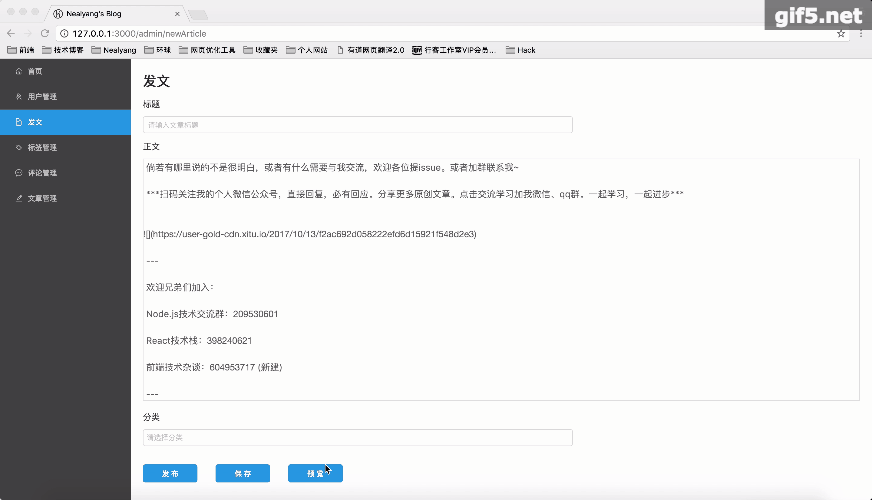
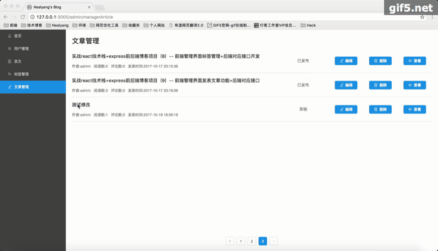

# React技术栈+Express+Mongodb实现个人博客

> 该项目暂停维护，欢迎关注后续开源的个人网站

## 说明

> 采用其他人的模板进行二次开发。 

## 功能描述

***前端部分***

- [x] 文章列表展示
- [x] 文章分类
- [x] 登录管理
- [x] 权限管理
- [x] 文章详情页展示
- [x] 管理员文章管理
- [x] 管理员标签管理
- [x] 发文（支持MarkDown语法）

***后端部分***
- [x] mongoose数据库操作
- [x] 路由管理
- [x] 身份验证
- [x] 基本的增删改查
- [x] ...

## 技术栈
- [x] react
- [x] react-redux
- [x] react-router
- [x] redux-saga
- [x] babel
- [x] webpack
- [x] Express
- [x] Mongodb
- [x] Mongoose

## TODO

- 文章评论 

## 项目运行效果

- 首页


- 非管理员登录


- 管理员登录


- 标签管理


- 查看文章详情


- 发表文章


- 修改文章


## 项目介绍

这个demo就是一个简单的增删改查的博客demo。前端用react技术栈、后端是express+mongoose。


## 环境

```
node @7.9.0
db @3.4.0
...
别的就直接npm install 了

注意MongoDB初始化后需要初始化一个admin/admin账户，用于登录后台管理
```

## 运行

    git clone git@github.com:Nealyang/React-Express-Blog-Demo.git
    
    npm i
    
    npm start

## 独立打包

    npm run build

## 生产环境启动
    
    npm run start-prod

## 开发数据库
> 链接: https://pan.baidu.com/s/1c3aedw8 密码: 5ii1

###### reference
[参考网址](https://github.com/Nealyang/React-Express-Blog-Demo)


