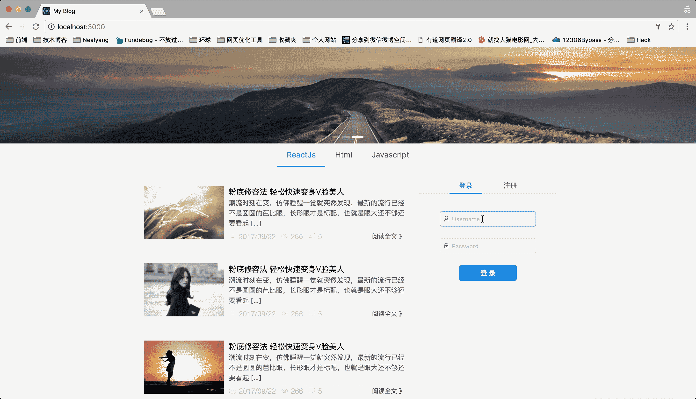

# 实战 react 技术栈+express 前后端博客项目（0）-- 预热一波

**_[项目地址：](https://github.com/Nealyang/React-Express-Blog-Demo)https://github.com/Nealyang/React-Express-Blog-Demo_**

> 本想等项目做完再连载一波系列博客，随着开发的进行，也是的确遇到了不少坑，请教了不少人。遂想，何不一边记录踩坑，一边分享收获呢。分享当然是好的，
> 如果能做到集思广益，那岂不是更美。我们的口号是：**_坚决不会烂尾_**

**_本博客为连载代码博客同步更新博客，随着项目往后开发可能会遇到前面写的不合适的地方会再回头修改。如有不妥~欢迎兄弟们不啬赐教。谢谢！_**

## 功能描述

**_前端部分_**

- [x] 文章列表展示
- [x] 文章分类
- [x] 登录管理
- [x] 文章详情页展示
- [x] 文章评论
- [x] 管理员文章管理
- [x] 管理员标签管理
- [x] 管理员评论管理
- [x] 发文（支持 MarkDown 语法）

**_后端部分_**

- [x] mongoose 数据库操作
- [x] 路由管理
- [x] 身份验证
- [x] 基本的增删改查
- [x] ...

## 技术栈

- [x] react
- [x] react-redux
- [x] react-router
- [x] redux-saga
- [x] babel
- [x] webpack
- [x] Express
- [x] Mongodb
- [x] Mongoose

## TODO

**_后续收工时候补充_**

## 项目运行效果（这个 GIF 不是连续播放的，我好烦）

- 加载

- 普通用户登录

- 管理员登录

## 项目介绍

当然这是一个全栈的开源 demo，在此之前写过一个[模仿大众点评的 Demo](https://github.com/Nealyang/React-Fullstack-Dianping-Demo),有兄弟反应说应该加点注释。
因为实在不想回头再麻烦，就想在这个 demo 中再加。

这个 demo 就是一个简单的增删改查的博客 demo。前端用 react 技术栈、后端是 express+mongoose。

## 项目实现步骤系列博客

- [x] [实战 react 技术栈+express 前后端博客项目（0）-- 预热一波](./00_预热一波.md)
- [ ] 实战 react 技术栈+express 前后端博客项目（1）-- 整体项目结构搭建、state 状态树设计
- [ ] 实战 react 技术栈+express 前后端博客项目（2）-- 前端 react-xxx、路由配置
- [ ] 实战 react 技术栈+express 前后端博客项目（3）-- 后端路由、代理以及静态资源托管等其他配置说明
- [ ] 实战 react 技术栈+express 前后端博客项目（4）-- 博客首页代码编写以及 redux-saga 组织
- [ ] 实战 react 技术栈+express 前后端博客项目（5）-- 前后端实现登录功能
- [ ] 实战 react 技术栈+express 前后端博客项目（6）-- 使用 session 实现免登陆+管理后台权限验证
- [ ] 实战 react 技术栈+express 前后端博客项目（7）-- 前端管理界面用户查看功能+后端对应接口开发
- [ ] 实战 react 技术栈+express 前后端博客项目（8）-- 前端管理界面标签管理功能+后端对应接口开发
- [ ] 实战 react 技术栈+express 前后端博客项目（9）-- 前端管理界面标签管理功能+后端对应接口开发
- [ ] 实战 react 技术栈+express 前后端博客项目（10）-- 前端管理界面发表文章功能
- [ ] 实战 react 技术栈+express 前后端博客项目（11）-- 后端接口对应文章部分的增删改查
- [ ] 实战 react 技术栈+express 前后端博客项目（12）-- 前端对于发文部分的完善（增删改查、分页等）
- [ ] 实战 react 技术栈+express 前后端博客项目（13）-- 前端对于发文部分的完善（增删改查等）
- [ ] 实战 react 技术栈+express 前后端博客项目（14）-- 内容详情页以及阅读数的展示
- [ ] 实战 react 技术栈+express 前后端博客项目（15）-- 博客添加评论功能以及对应后端实现
- [ ] 实战 react 技术栈+express 前后端博客项目（16）-- pm2 的使用说明
- [ ] 实战 react 技术栈+express 前后端博客项目（17）-- 收工

## 交流

**_扫码关注我的个人微信公众号，分享更多原创文章。点击交流学习加我微信、qq 群。一起学习，一起进步_**
